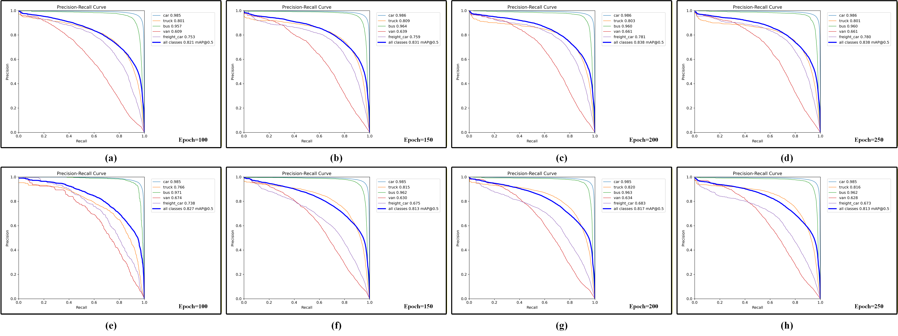

# IAWMamba

**Illumination-Adaptive Weakly-Aligned Multimodal Mamba for UAV Small Object Detection**

&gt; 📄 **Paper Status**: Under Review  
&gt; 🔓 **Code Release**: Will be fully open-sourced upon paper acceptance

---

## Overview

This repository contains the official implementation of **IAWMamba**, an illumination-adaptive weakly aligned multimodal detection framework designed for robust small object detection in UAV remote sensing under complex imaging conditions.

---

## Key Features

- **MSDE Module**: Modality-Specific Difference Enhancement for improved infrared feature discriminability
- **WMFE Module**: Weakly-Aligned Mamba Feature Extractor for stable cross-modal interaction without precise registration
- **IAMF Module**: Illumination-Aware Multimodal Fusion for robust aggregation under non-uniform lighting
- **Lightweight Design**: Efficient architecture tailored for UAV platform constraints

---

## Code Availability

&gt; ⚠️ **Coming Soon**
&gt; 
&gt; The complete source code, pre-trained models, and training configurations will be **released upon acceptance of our manuscript**.
&gt;
&gt; Stay tuned for updates!

---

## Visualization Results

### Training Dynamics on DroneVehicle Dataset



**Visualizations of the average precision (AP) curves for the DroneVehicle test set.** Panels (a)-(d) correspond to OBB annotations, and panels (e)-(h) correspond to HBB annotations. Each curve illustrates the model's performance across different training checkpoints (100, 150, 200, and 250 epochs), providing insights into the training dynamics and convergence behavior.

---

## Citation

If you find this work useful, please consider citing our paper once it is published:

```bibtex
@article{iawmamba2025,
  title={IAWMamba: Illumination-Adaptive Weakly-Aligned Multimodal Mamba for UAV Small Object Detection},
  author={[Authors]},
  journal={[Journal Name]},
  year={2025}
}
