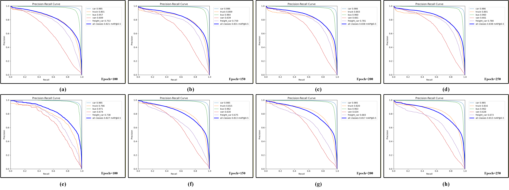

# IAPF

**IAPF: Infrared-Anchored Progressive Fusion for Weakly Aligned Visible–Infrared Object Detection**

> 📄 **Paper Status**: Under Review  
> 🔓 **Code Release**: The complete code will be released upon paper acceptance

---

## Overview

This repository contains the official implementation of **IAPF**, an infrared-anchored progressive fusion framework for weakly aligned visible–infrared object detection in UAV imagery.

Visible and infrared images provide complementary appearance and thermal information. However, their effective fusion remains challenging because of spatial misalignment, non-uniform illumination, sensor-response differences, and background interference.

IAPF addresses these challenges through a progressive, discrepancy-aware fusion strategy. It extracts an input-level multispectral discrepancy cue, validates the cue using task-relevant infrared structural evidence, models long-range cross-modal dependencies under weak alignment, and applies a bounded residual prior to regulate the final fusion.

---

## Framework

The proposed IAPF framework consists of four principal components:

- **MEDM**: Multispectral Energy Discrepancy Map
- **PSDE**: Prior-Guided Structural Difference Enhancement
- **WMFE**: Task-Guided Weak-Alignment Mamba Feature Extractor
- **RPGF**: Residual Prior-Guided Fusion

The framework uses infrared features as an explicit anchor while progressively incorporating structurally supported cross-modal information.

---

## Key Features

- **Infrared-Anchored Fusion**  
  Retains the original infrared representation as an explicit fusion candidate, providing a stable reference when visible imagery is degraded by complex illumination.

- **Multispectral Energy Discrepancy Map (MEDM)**  
  Extracts a coarse input-level discrepancy cue from paired visible and infrared images without directly treating the discrepancy as a modality-reliability score.

- **Prior-Guided Structural Difference Enhancement (PSDE)**  
  Uses sparse cross-scale infrared structural evidence and semantic compensation to validate the discrepancy cue and suppress responses unrelated to target structures.

- **Task-Guided Weak-Alignment Mamba Feature Extractor (WMFE)**  
  Combines task-guided feature modulation, pixel-wise alternating rearrangement, and state-space modeling to capture long-range cross-modal dependencies with reduced reliance on precise local correspondence.

- **Residual Prior-Guided Fusion (RPGF)**  
  Constructs an identity-centered fusion prior with explicitly bounded spatial variation, regulating competition between infrared and cross-modal representations without allowing the raw discrepancy cue to directly determine fusion weights.

- **Lightweight Architecture**  
  Contains only **6.79M trainable parameters** and achieves **95.3 FPS** on an NVIDIA RTX 4090 GPU, providing a practical balance between detection accuracy and computational efficiency.

- **Multiple Detection Settings**  
  Evaluated on oriented bounding-box detection, horizontal bounding-box detection, and aerial pedestrian detection tasks.

---

## Supported Datasets

IAPF is evaluated on three weakly aligned UAV-based visible–infrared datasets:

### DroneVehicle

DroneVehicle is a large-scale drone-based RGB–infrared vehicle detection dataset containing paired visible and infrared images captured under diverse illumination conditions. It provides both oriented bounding-box and horizontal bounding-box annotations for five vehicle categories.

- [Official Repository and Dataset Download](https://github.com/VisDrone/DroneVehicle)
- Categories: Car, Truck, Freight Car, Bus, and Van
- Tasks used in IAPF: OBB and HBB object detection

### DVTOD

DVTOD is a drone-based visible–thermal object detection dataset characterized by spatial misalignment, illumination changes, adverse weather, occlusion, and other challenging imaging conditions.

- [Official Repository](https://github.com/VDT-2048/DVTOD)
- [Official Dataset Download — Baidu Netdisk](https://pan.baidu.com/s/1KMHdbwQwwY0dkEy6TkJC6A?pwd=wqnq)
- Baidu Netdisk extraction code: `wqnq`
- Task used in IAPF: Weakly aligned visible–thermal object detection

### VTUAV-det

VTUAV-det is the object-detection version of the VTUAV visible–thermal UAV tracking dataset. It was created by sampling and annotating person-rich sequences from VTUAV while retaining its official training and testing split.

- [Official VTUAV-det Project](https://github.com/NNNNerd/RGBTDronePerson)
- [Official VTUAV-det Download — Google Drive](https://drive.google.com/drive/folders/1kBomGd7bu-9MiUDGmViHqmV9baN739iG?usp=sharing)
- [Official VTUAV-det Download — Baidu Netdisk](https://pan.baidu.com/s/1-vZh-5qs9JKrqrsP7V0vdA?pwd=j2t2)
- Baidu Netdisk extraction code: `j2t2`
- [Original VTUAV Benchmark](https://github.com/zhang-pengyu/DUT-VTUAV)
- Task used in IAPF: UAV-based RGB–thermal pedestrian detection

> Please follow the licenses and terms of use specified by the respective dataset providers. This repository does not redistribute the datasets.

---

## Main Contributions

1. We formulate weakly aligned visible–infrared fusion as a progressive, discrepancy-aware process. The coarse discrepancy cue is structurally validated before cross-modal interaction and conditioned on task-related information before final fusion.

2. We introduce PSDE and task-guided WMFE. PSDE identifies where the multispectral discrepancy is supported by infrared target structures, while WMFE efficiently models broader cross-modal dependencies under weak alignment.

3. We develop RPGF to generate an identity-centered prior with bounded spatial correction. This design prevents unconstrained discrepancy-based weighting and retains infrared information as an explicit fusion candidate.

4. Extensive experiments on DroneVehicle, DVTOD, and VTUAV-det demonstrate the effectiveness of IAPF across different datasets, detection tasks, and evaluation protocols.

---

## Code Availability

> ⚠️ **Coming Soon**
>
> The complete source code, pretrained models, dataset configurations, training scripts, and evaluation instructions will be released upon acceptance of the manuscript.
>
> Please stay tuned for future updates.

---

## Visualization Results

### Training Dynamics on the DroneVehicle Dataset



**Average precision curves on the DroneVehicle test set.** Panels (a)–(d) present the results under oriented bounding-box annotations, while panels (e)–(h) present the results under horizontal bounding-box annotations. The curves illustrate model performance at different training checkpoints and provide insight into the convergence behavior of IAPF.

---

## Qualitative Results

Additional qualitative comparisons on DroneVehicle, DVTOD, and VTUAV-det will be provided together with the complete code release.

The visual results will include:

- Oriented bounding-box detection on DroneVehicle
- Horizontal bounding-box detection on DroneVehicle
- Vehicle detection under weak cross-modal alignment
- Aerial pedestrian detection on VTUAV-det
- Comparisons with representative visible–infrared detection methods

---

## Citation

If you find this work useful, please consider citing our paper after it is published:

```bibtex
@article{iapf2026,
  title   = {IAPF: Infrared-Anchored Progressive Fusion for Weakly Aligned Visible--Infrared Object Detection},
  author  = {[Authors]},
  journal = {[Journal Name]},
  year    = {2026}
}
```

The final BibTeX entry will be updated after the paper is accepted and published.

---

## License

The license and terms of use will be provided when the source code is released.

---

## Contact

For questions regarding IAPF, please contact the authors or open an issue in this repository after the code is released.
